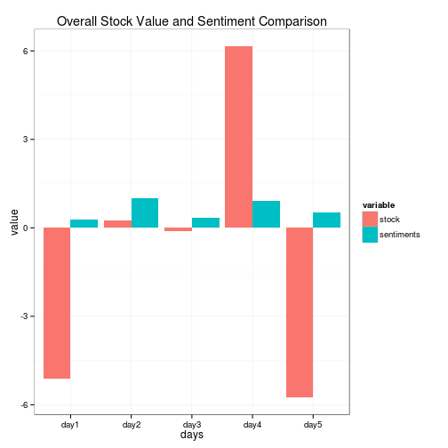

Stock Prediction of Google Using Twitter Sentiment Analysis
========================================================
Sonali Changkakoti
Illinois State University
IT 497, Group Assignment # 2

A sentiment analysis was conducted using the tweets of people from Twitter about Google. Total number of twwets each day were 200.

The sentiment histograms for each day are given below:

     

A graph comparing the changes in stock prices for the 5 days to the actual stock price changes is given below:

 

Twitter data were used to study the sentiments of the people. It was observed that the emotions and moods of individuals affect their decision making process, thus, leading to a direct correlation between public sentiment and market sentiment.  Sentiments were calculated from 200 tweets of Google for each day from December 1, 2014 to December 5, 2014. When the sentiments were positive and higher, the stock price were increasing and when the sentiments were negative or lower positive, the stock price were declining.
Out of 5 days, there was an exception for the correlation between the sentiment and stock price on the last day. Here, the sentiment was positive and higher but the stock price had decreased. It might be 

 

